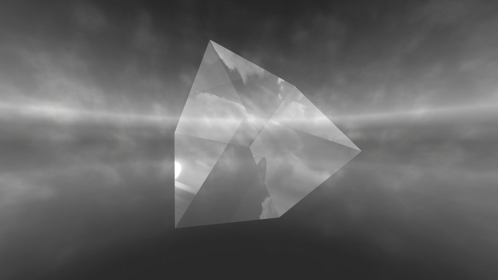
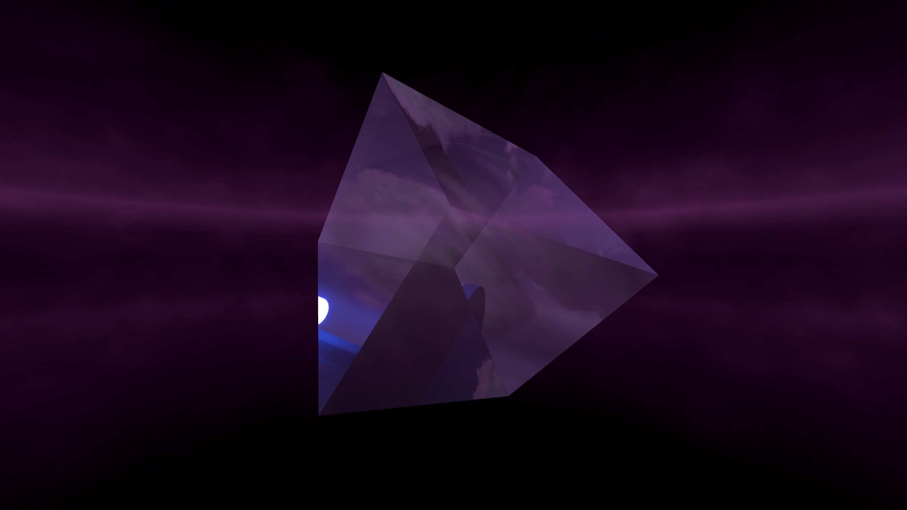
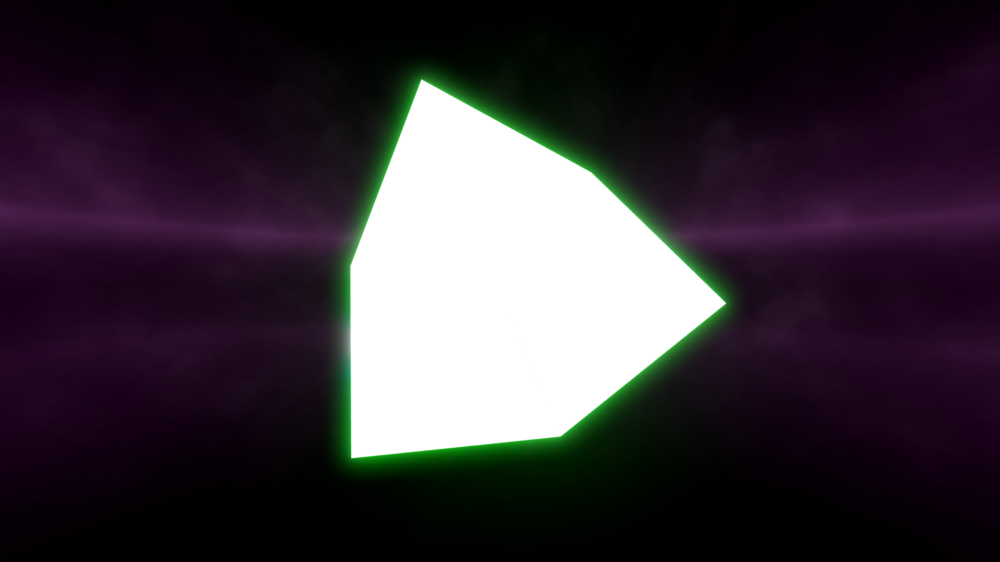
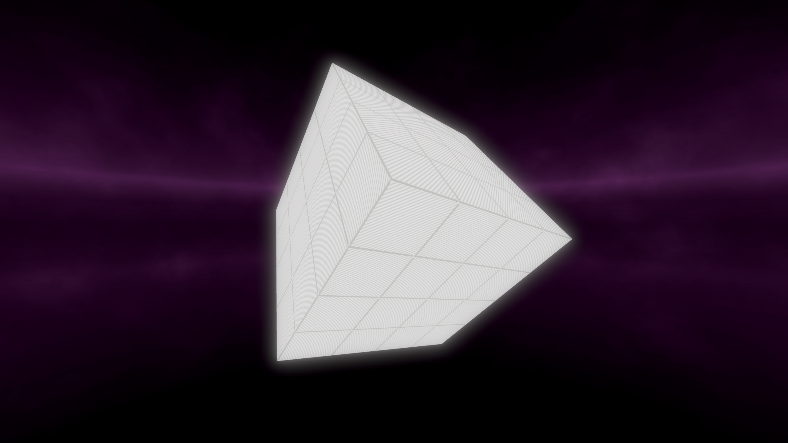

# Info

### My Vocab
Anytime I mention "env pieces" I'm referring to game objects that are loaded in when a level is loaded, which can be affected with Environment Enhancement. 

Anytime I mention "directional lights" I'm referring to the `DirectionalLight` game objects in the env. For example, on Billie there are `DirectionalLightFront`, `DirectionalLightBack`, `DirectionalLightLeft`, and `DirectionalLightRight` under `DayAndNight/Day` and `DayAndNight/Night`

### Details
All screenshots use the Billie environment with all of the env pieces being removed, except for `BigSmokePS`, to show whether or not the material will be "corrupted" on the envs that do that to geo. (See ["Corruption"](README.md#corruption))

If a screenshot has any other env pieces/geo/game objects, it was done to show a certain type of effect that the material will have. For example, some shader keywords will cause any smoke to not be visible from behind the geo. In these cases, I likely threw in the `Clouds` env piece or something else to better demonstrate that.

All screenshots have the environment fog unchanged from the default values unless specified otherwise. 

All screenshots have the geo and env rotated a bit to show how a material will react to directional lights. 

In any screenshots with the background colored, every light for the env was set to either red or blue and the lights for geo were set to green to show how the lightmaps/reflection probes would affect the material.

All code snippets will use `map` as the output. Here's an example of that, with `ExpertPlusLawless.dat` being the input and `ExpertPlusStandard.dat` being the output:
```typescript
const map = new Difficulty("ExpertPlusLawless.dat", "ExpertPlusStandard.dat");
```
You can change it to whatever you want but the `map` in the material code will have to match whatever you chose for your output difficulty.

If a material does not have the `color:` set, then it cannot be colored by the material. However, it still could be colored by: the lightmap, directional lights, or by lighting the geo itself, if supported.

### "Corruption"
The environments I know of currently that "corrupt" some materials are Billie & Interscope.

These materials will be corrupted if these environments are in use, or even loaded *before* playing the map even if the environment you use is not one of them. So, it is best to not use them.

Example of what I'm calling "corrupted": 
```typescript
map.geoMaterials["DefaultConcrete"] = {
  shader: "InterscopeConcrete",
  color: [1,1,1,1]
}
```
[Corrupted Example Image](https://github.com/Shonshyn/BS-Tools-for-Mappers/blob/main/Geo%20Materials/corrupted%20example1.png) 

# Material List
[Fixed Concrete](README.md#fixed-concrete-material)

[Wood/Stone](README.md#woodstone-material)

[Crystal/Glass](README.md#crystalglass-material)

[Grid](README.md#grid-material)

[Invisible](README.md#invisible-material)

## Fixed Concrete Material
Tries to match the default `InterscopeConcrete` shader as much as possible, but without a light map to remove the "corruption". This way of doing it also removes the ability to color the material, but I might try to find a way to fix that later.

Comparison:


Material on the left:
```typescript
map.geoMaterials["DefaultConcrete"] = {
  shader: "InterscopeConcrete",
  color: [0, 1, 0, 1]
}
```

Material on the Right:
```typescript
map.geoMaterials["FixedConcrete"] = {
  shader: "InterscopeConcrete",
  shaderKeywords: ["DIRT", "ENABLE_DIFFUSE", "ENABLE_DIRT", "ENABLE_DIRT_DETAIL", "ENABLE_FOG", "ENABLE_GROUND_FADE", "ENABLE_SPECULAR", "ENABLE_VERTEXT_COLOR", "FOG", "NOISE_DITHERING", "REFLECTION_PROBE", "REFLECTION_PROBE_BOX_PROJECTION", "REFLECTION_PROBE_BOX_PROJECTION_OFFSET", "_EMISSION", "_ENABLE_FOG_TINT", "_RIMLIGHT_NONE"]
}
```

## Wood/Stone Material
```typescript
map.geoMaterials["WoodMat"] = {
  shader: "InterscopeConcrete",
  color: [0.5, 0.368, 0.36, 1],
  shaderKeywords: ["DIFFUSE", "DIRT", "FOG", "REFLECTION_PROBE_BOX_PROJECTION"]
}
```


## Crystal/Glass Material
```typescript
map.geoMaterials["CrystalMat"] = {
  shader: "TransparentLight",
  shaderKeywords: [
    "REFLECTION_PROBE"
  ]
};
```
Unlit:


Lit:


## Grid Material
This material always glows for some reason, it could be possible that the glow can be removed but I haven't figured it out.
```typescript
map.geoMaterials["GridMat"] = {
  shader: "WaterfallMirror",
  shaderKeywords: ["ENABLE_DIRT"]
}
```


## Invisible Material
This material is invisible or does not render or something idk, a great way to get some collision without using an unlit light.
```typescript
map.geoMaterials["InvisMat"] = {
  shader: "InterscopeConcrete",
  shaderKeywords: ["INSTANCING_ON"]
}
```


